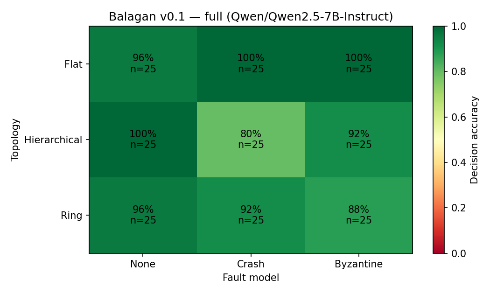

# Balagan 🎪

[](https://github.com/zahere/balagan/actions/workflows/ci.yml)
[](LICENSE)
[](pyproject.toml)
[](https://docs.nebius.com/serverless/overview)

**Chaos engineering for multi-agent LLM meshes — which topology survives which failure?**

Balagan (Hebrew: בלגן, "chaos") injects faults into multi-agent LLM systems and measures what happens to their collective decision quality. It runs the same verification task across three mesh topologies under three fault conditions, and renders the result as a topology × fault-model resilience heatmap.

Built for the [Nebius Serverless AI Builders Challenge](https://nebius.com/serverless-ai-builders-challenge): the sweep runs as a **Nebius Serverless Job** against a model served on a **Nebius Serverless Endpoint** (vLLM). The harness practices what it preaches — checkpointed, retry-wrapped, and resumable, so you can kill the job mid-sweep and resubmit it without losing a trial.

**The published sweep** (225 trials, Qwen2.5-7B-Instruct on a Nebius Serverless Endpoint, zero trial errors): flat/majority held 100% under both fault models; hierarchical dropped to **80% under crash** — exactly the structural prediction, since a uniform victim kills the aggregator in 1 of 5 trials and an undecided mesh scores as wrong; ring was weakest under byzantine (**88%**), where one late-chain saboteur owns the final verdict.



Forensic detail worth the click: in hierarchical/crash, **all five losses — and only those five — were aggregator deaths** (SPOF loss predicted 20%, measured 20%), and flat's immunity costs **2.8× the tokens per trial**. Companion charts from the same run: [latency under fault](results/full/latency_under_fault.png) (where a *faster* mesh turns out to be a *failing* mesh) · [the price of resilience](results/full/price_of_resilience.png).

*(A mock-mode sample lives in `results/sample_mock/` — that one validates the pipeline, not the finding.)*

## What it measures

- **Topologies:** `flat` (all-to-all debate, majority vote) · `hierarchical` (workers + single aggregator) · `ring` (sequential refinement, last agent decides)
- **Fault models:** `none` (baseline) · `crash` (a random agent is silent for the whole trial) · `byzantine` (a random agent is prompted to covertly argue for the wrong verdict — the traitor is just a system prompt)
- **Task:** claim verification with objective ground truth, on a deterministic synthetic dataset (`data/claims_demo.jsonl`, regenerable byte-identically via `balagan gen-claims`). The task is deliberately easy in the fault-free condition, so accuracy loss is attributable to the fault, not task difficulty.
- **Metric:** decision accuracy per (topology, fault) cell. A mesh that can't decide scores as wrong.

## Architecture

```
                          ┌───────────────────────────────┐
                          │  Nebius Serverless ENDPOINT   │
                          │  vLLM · Qwen2.5-7B-Instruct   │
                          │  gpu-l40s-a · OpenAI-compat   │
                          └──────────────▲────────────────┘
                                         │ chat completions
                                         │ (exponential-backoff retry)
┌────────────────────┐   ┌───────────────┴───────────────┐
│ configs/*.yaml     │──▶│  Nebius Serverless JOB (CPU)  │
│ topologies ×       │   │  balagan run --config …       │
│ faults × trials    │   │  async fan-out, bounded       │
└────────────────────┘   │  fault injection per trial    │
                         └───────────────┬───────────────┘
                                         │ one object per finished trial
                                         ▼
                          ┌───────────────────────────────┐
                          │  Nebius OBJECT STORAGE        │
                          │  {prefix}/{run}/trials/*.json │
                          │  ← the checkpoint of record   │
                          └──────────────┬────────────────┘
                                         │ balagan report
                                         ▼
                        results.jsonl · summary.md · heatmap.png
```

**The job's filesystem is ephemeral.** When a Serverless Job VM is released,
local disk goes with it — so the checkpoint lives in Object Storage, one object
per trial (S3 has no append, and one-object-per-trial makes resume a LIST and
every write atomic and idempotent). Cancel the job mid-sweep, resubmit the same
spec, and it picks up exactly where it died. Regression-tested in
[`tests/test_store_resume.py`](tests/test_store_resume.py).

## Quickstart — 60 seconds, no GPU, no account (mock mode)

Verifies the entire pipeline offline with a deterministic simulated model:

```bash
git clone https://github.com/zahere/balagan && cd balagan
pip install .
balagan run --config configs/demo.yaml --mock
balagan report --config configs/demo.yaml
open results/demo/heatmap.png
```

## Run it for real — any OpenAI-compatible endpoint

```bash
export NEBIUS_ENDPOINT_URL="https://<your-endpoint-host>/v1"
export NEBIUS_API_KEY="<your-key>"
balagan run --config configs/demo.yaml          # ~72 trials
balagan report --config configs/demo.yaml
```

## Run it on Nebius Serverless (as submitted)

Full step-by-step in **[`nebius/RUNBOOK.md`](nebius/RUNBOOK.md)** — including quota,
Object Storage setup, and the kill-and-recover demo. Short version:

```bash
./nebius/1_deploy_endpoint.sh    # vLLM endpoint, gpu-l40s-a
source nebius/endpoint.env
export IMAGE=docker.io/<you>/balagan:0.1.0 && docker build -t $IMAGE . && docker push $IMAGE
./nebius/2_run_job.sh "run --config configs/demo.yaml --limit 10"   # smoke test
./nebius/2_run_job.sh                                               # full sweep
./nebius/3_report.sh configs/full.yaml
```

Then cancel the job mid-sweep (`nebius ai job delete <JOB_ID>`), resubmit, and watch:

```
[balagan] run 'full': 225 trials total | resume: 93 already complete | 132 to run
```

## Hardware & cost

| Piece | Platform / preset | Runtime | Approx. cost |
|---|---|---|---|
| Endpoint (vLLM, 7B) | `gpu-l40s-a` / `1gpu-8vcpu-32gb` | ~7 min cold start, then live during sweeps | TODO |
| Job — `demo` (72 trials) | `cpu-d3` / `4vcpu-16gb` | 31 s sweep (~2 min job incl. image pull) | TODO |
| Job — `full` (225 trials) | `cpu-d3` / `4vcpu-16gb` | 63 s sweep (~2.5 min job incl. image pull) | TODO |
| Mock mode | your laptop | <5 s | $0 |

The sweep job is **CPU-only** — all GPU cost is the endpoint, billed only while
it's up. That split is the whole reason serverless fits this workload.

<!-- TODO: fill measured numbers from the real runs + console screenshots in docs/ -->

## Expected output

`make mock` (or the quickstart above) finishes in under a minute and leaves:

```
results/demo/
├── trials/…               # one JSON object per trial (the checkpoint itself)
├── results.jsonl           # all trials, flattened
├── summary.md              # accuracy table per (topology × fault) cell
└── heatmap.png             # the resilience heatmap
```

Real-endpoint runs additionally emit `latency_under_fault.png` (per-cell trial
latency — where you learn that a *faster* mesh may be a *failing* mesh) and
`price_of_resilience.png` (tokens/trial vs worst-case accuracy). All charts
regenerate offline from the committed `results/full/results.jsonl` via
`balagan report --config configs/full.yaml` — no bucket or endpoint needed.

On a real endpoint run, the job logs show the resume header, per-10-trial progress
lines, and a completion line — see the sample in `nebius/RUNBOOK.md` step 6.

## How to adapt

- **Your own topology:** implement one `async def run_<name>(client, claim, roster)`
  in `topology.py`, register it in `PROTOCOLS`, add it to the config list.
- **Your own fault model:** add a branch in `faults.py::apply_fault` (e.g. message
  delay, partition-by-subgroup).
- **Your own task:** any dataset of `{"id", "claim", "label"}` JSONL works —
  keep the fault-free baseline near ceiling or fault effects get confounded.
- **Preemptible capacity:** `PREEMPTIBLE=true ./nebius/2_run_job.sh` — safe by
  construction, since a preempted job resumes exactly like a cancelled one.

## Chaos-testing a LangGraph mesh

The fault models inject at the *agent* level, so the harness doesn't care how
the mesh is wired. `pip install -e ".[langgraph]"` and the same three shapes run
as **compiled LangGraph `StateGraph`s** — parallel fan-out/fan-in supersteps,
reducer-merged state, one graph per trial — with Balagan's client, faults, and
scoring unchanged (`src/balagan/adapters/langgraph_mesh.py`):

```bash
balagan run --config configs/langgraph-demo.yaml --mock   # offline, $0
balagan report --config configs/langgraph-demo.yaml
```

If you run agents in production, you already live in one of these rows:
supervisor/orchestrator patterns → `lg-hierarchical` · sequential chains →
`lg-ring` · debate/swarm-with-vote → `lg-flat`. Adapters for other frameworks
are the v0.2 headline — the plugin surface is one async function.

## Troubleshooting

- **Endpoint `ERROR` in ~2–3 min with no container logs** → the image pull
  exceeded the cold-start window. Mirror `vllm/vllm-openai` into your in-region
  Nebius Container Registry and deploy from there (pattern:
  [cookbook `nim-endpoint`](https://github.com/nebius/serverless-ai-cookbook/tree/main/inference/nim-endpoint)).
- **Endpoint stuck `STARTING`** → usually model download; follow
  `nebius ai endpoint logs <id> --follow`. Escalate past ~30 min.
- **Job fails with no logs** → entrypoint issue; rerun with
  `<command> || (echo FAILED; sleep 86400)` and SSH in (`ssh nebius@<ip>`).
- **`resume: 0` after a cancel** → the job ran without `S3_*` env vars, so the
  checkpoint died with the VM. `2_run_job.sh` hard-fails on this for a reason.

## Reproducibility notes

- `temperature: 0`, fixed `seed`, deterministic victim selection per trial (`seed:trial_id`), deterministic dataset generation (`balagan gen-claims` regenerates it byte-identically).
- Claim generators default to arithmetic/comparison only. `letter_count` is available but off by default: it is tokenization-hostile for small models and would pull the fault-free baseline off the ceiling, confounding fault effects with task difficulty.
- Dependencies pinned in `pyproject.toml`; container build via `Dockerfile`.
- Checkpoint = one immutable object per trial; resume is a LIST, re-runs are idempotent.
- One failing trial records an error row and never takes down the sweep.
- No secrets in the repo; endpoint and storage credentials come from env vars only.

## Configuration

Everything lives in one YAML (see `configs/demo.yaml`): model, topology list, fault list, trials per cell, agent count, concurrency, seed, token/temperature caps, results dir. `--limit N` runs the first N trials as a smoke test. Storage settings (`s3_*`) are overridden by the standard `S3_*` / `AWS_*` env vars that `nebius ai job create --env` passes in.

## Roadmap (v0.2)

Mid-protocol crash points · partition faults (subgroup isolation) · latency-degradation faults · multi-SKU/model resilience benches with cost columns (à la the cookbook's `parabricks-deepvariant/bench`) · formal pre-verification of topology protocols via [`agenticraft-foundation`](https://pypi.org/project/agenticraft-foundation/) (CSP/MPST/CTL) — prove it, then break it.

## License

MIT © 2026 Zaher Khateeb
